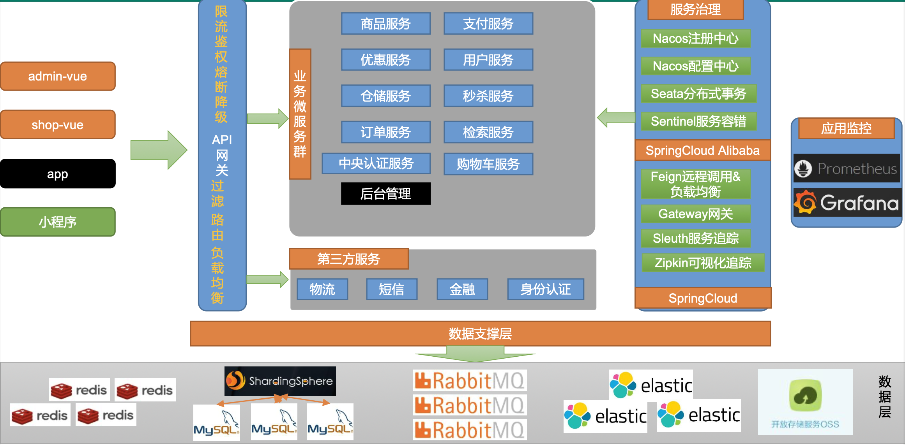

# 谷粒商城项目总结


## 一、分布式基础&环境搭建

### 1. 项目架构图

#### 1.1 项目微服务架构图


#### 2.2 微服务划分图




### 2. 环境搭建

#### 2.1 docker 一些命令

```shell
#设置 docker 开机自启
sudo systemctl enable docker

#docker 安装 mysql
docker run -p 3306:3306 --name mysql \
-v /mydata/mysql/log:/var/log/mysql \
-v /mydata/mysql/data:/var/lib/mysql \
-v /mydata/mysql/conf:/etc/mysql \
-e MYSQL_ROOT_PASSWORD=root \
-d mysql:5.7
#参数说明
#     -p 3306:3306:将容器的 3306 端口映射到主机的 3306 端口
#     -v /mydata/mysql/conf:/etc/mysql:将配置文件夹挂载到主机
#     -v /mydata/mysql/log:/var/log/mysql:将日志文件夹挂载到主机 
#     -v /mydata/mysql/data:/var/lib/mysql/:将配置文件夹挂载到主机 
#			-e MYSQL_ROOT_PASSWORD=root:初始化 root 用户的密码

#MYSQL 配置
vi /mydata/mysql/conf/my.cnf 
[client] 
default-character-set=utf8
[mysql] 
default-character-set=utf8
[mysqld] 
init_connect='SET collation_connection = utf8_unicode_ci' 
init_connect='SET NAMES utf8'
character-set-server=utf8 
collation-server=utf8_unicode_ci 
skip-character-set-client-handshake
skip-name-resolve

#通过容器的 mysql 命令行工具连接
docker exec -it mysql mysql -uroot -proot

#docker 安装 redis
mkdir -p /mydata/redis/conf
touch /mydata/redis/conf/redis.conf

docker run -p 6379:6379 --name redis -v /mydata/redis/data:/data \ 
-v /mydata/redis/conf/redis.conf:/etc/redis/redis.conf \
-d redis redis-server /etc/redis/redis.conf

#使用 redis 镜像执行 redis-cli 命令连接
docker exec -it redis redis-cli

```

#### 2.2 Maven

```xml
<!--配置阿里云镜像-->
<mirrors> 
  <mirror>
		<id>nexus-aliyun</id>
		<mirrorOf>central</mirrorOf>
		<name>Nexus aliyun</name> 
    <url>http://maven.aliyun.com/nexus/content/groups/public</url>
	</mirror>
</mirrors>

<!-- 配置 jdk1.8 编译项目-->
<profiles>
	<profile> 
    <id>jdk-1.8</id>
		<activation> 
      <activeByDefault>true</activeByDefault> 
      <jdk>1.8</jdk>
		</activation>
  	<properties>
			<maven.compiler.source>1.8</maven.compiler.source> 
    	<maven.compiler.target>1.8</maven.compiler.target> 
    	<maven.compiler.compilerVersion>1.8</maven.compiler.compilerVersion>
		</properties> 
 	</profile>
</profiles>
```

#### **2.3 Idea&VsCode**

```
idea 安装 lombok、mybatisx 插件

Vscode 安装开发必备插件
Vetur —— 语法高亮、智能感知、Emmet 等包含格式化功能， Alt+Shift+F (格式化全文)，Ctrl+K Ctrl+F(格式化选中代码，两个 Ctrl需要同时按着)
EsLint —— 语法纠错
Auto Close Tag —— 自动闭合 HTML/XML 标签
Auto Rename Tag —— 自动完成另一侧标签的同步修改
JavaScript(ES6) code snippets —— ES6 语法智能提示以及快速输入，除 js 外还支 持.ts，.jsx，.tsx，.html，.vue，省去了配置其支持各种包含 js 代码文件的时间
HTML CSS Support —— 让 html 标签上写 class 智能提示当前项目所支持的样式
HTML Snippets —— html 快速自动补全
Open in browser —— 浏览器快速打开
Live Server —— 以内嵌服务器方式打开
Chinese (Simplified) Language Pack for Visual Studio Code —— 中文语言包
```

#### 2.4 Git 的相关配置

```shell
#查看系统config
git config --system --list
　　
#查看当前用户（global）配置
git config --global  --list
 
#查看当前仓库配置信息
git config --local  --list

$ git config --global user.name "leehao"  #名称
$ git config --global user.email "leehao99@163.com"   #邮箱

ssh -V
sudo apt-get install openssh-client openssh-server   # SSH安装命令
cd ~/.ssh
# 生成ssh密钥，这条语句会在.ssh 文件夹中生成两个必要的文件：id_rsa和id_rsa.pub。这是用rsa算法生成的公钥和私钥。
ssh-keygen -C "xxx@gmail.com" -t rsa	

# 若之前已存在，可以自定义生成 
ssh-keygen -C "xxx@gmail.com" -t rsa -f ~/.ssh/id_rsa_new

#设置全局代理
#http
git config --global https.proxy http://127.0.0.1:7890
#https
git config --global https.proxy https://127.0.0.1:7890
//使用socks5代理的 例如ss，ssr 1080是windows下ss的默认代理端口,mac下不同，或者有自定义的，根据自己的改
git config --global http.proxy socks5://127.0.0.1:7890
git config --global https.proxy socks5://127.0.0.1:7890

#只对github.com使用代理，其他仓库不走代理
git config --global http.https://github.com.proxy socks5://127.0.0.1:7890
git config --global https.https://github.com.proxy socks5://127.0.0.1:7890
#取消github代理
git config --global --unset http.https://github.com.proxy
git config --global --unset https.https://github.com.proxy

#取消全局代理
git config --global --unset http.proxy
git config --global --unset https.proxy


#idea配置 Github, 需要上GitHub上获取token
```


## 二、SpringCloud Alibaba 分布式组件

## 1. SpringCloud Alibaba 简介

### 1.1简介	

​	Spring Cloud Alibaba 致力于提供微服务开发的一站式解决方案。此项目包含开发分布式应用 微服务的必需组件，方便开发者通过Spring Cloud 编程模型轻松使用这些组件来开发分布式应用服务。

​	依托 Spring Cloud Alibaba，您只需要添加一些注解和少量配置，就可以将 Spring Cloud 应用 接入阿里微服务解决方案，通过阿里中间件来迅速搭建分布式应用系统。

```xml
https://github.com/alibaba/spring-cloud-alibaba
```

**SpringCloud** 的几大痛点
	SpringCloud 部分组件停止维护和更新，给开发带来不便;
	SpringCloud 部分环境搭建复杂，没有完善的可视化界面，我们需要大量的二次开发和定制 SpringCloud 配置复杂，难以上手，部分配置差别难以区分和合理应用

**SpringCloud Alibaba** 的优势: 

​	阿里使用过的组件经历了考验，性能强悍，设计合理，现在开源出来大家用成套的产品搭配完善的可视化界面给开发运维带来极大的便利 搭建简单，学习曲线低。

结合 **SpringCloud Alibaba** 我们最终的技术搭配方案:

<font color = red>**SpringCloud Alibaba - Nacos**:注册中心(服务发现**/**注册) </font>

<font color = red>**SpringCloud Alibaba - Nacos**:注册中心(服务发现**/**注册) </font>

<font color = red>**SpringCloud Alibaba - Nacos**:配置中心(动态配置管理) </font>

<font color = blue>**SpringCloud - Ribbon**:负载均衡</font>

<font color = blue>**SpringCloud - Feign**:声明式 **HTTP** 客户端(调用远程服务) </font>

<font color = red>**SpringCloud Alibaba - Sentinel**:服务容错(限流、降级、熔断) </font>

<font color = blue>**SpringCloud - Gateway**:**API** 网关(**webflux** 编程模式)</font>

<font color =blue >**SpringCloud - Sleuth**:调用链监控</font>

<font color = red>**SpringCloud Alibaba - Seata**:原 **Fescar**，即分布式事务解决方案</font>

### 1.2 版本选择

https://github.com/alibaba/spring-cloud-alibaba/wiki/%E7%89%88%E6%9C%AC%E8%AF%B4%E6%98%8E

### 1.3 项目中的依赖

```xml
<dependencyManagement>
    <dependencies>
        <dependency>
            <groupId>com.alibaba.cloud</groupId>
            <artifactId>spring-cloud-alibaba-dependencies</artifactId>
            <version>2022.0.0.0-RC1</version>
            <type>pom</type>
            <scope>import</scope>
        </dependency>
    </dependencies>
</dependencyManagement>
```


## 2. SpringCloud Alibaba-Nacos[作为注册中心]

​	Nacos 是阿里巴巴开源的一个更易于构建云原生应用的动态服务发现、配置管理和服务管理 平台。他是使用 java 编写。

​	需要依赖 java 环境
 	Nacos 文档地址: https://nacos.io/zh-cn/docs/quick-start.html

### 2.1 下载nacos-server

https://github.com/alibaba/nacos/releases

### 2.2 启动 **nacos-server**

* 双击bin中的startup.cmd文件  / Mac到bin目录底下执行 sh startup.sh -m standalone

* 访问http://localhost:8848/nacos/
* 使用默认的nacos/nacos进行登录

### 2.3 将微服务注册到 **nacos** 中

* 首先，修改 **pom.xml** 文件，引入 **Nacos Discovery Starter**

  ```xml
  <dependency>
  	<groupId>com.alibaba.cloud</groupId> 
  	<artifactId>spring-cloud-starter-alibaba-nacos-discovery</artifactId>
  </dependency>
  ```

* 在应用的 **/src/main/resources/application.properties** 配置文件中配置 **Nacos Server** 地址

  ```yml
  spring.cloud.nacos.discovery.server-addr=127.0.0.1:8848
  ```

* 使用**@EnableDiscoveryClient** 开启服务注册发现功能

  ```java
  @SpringBootApplication
  @EnableDiscoveryClient
  public class GulimallCouponApplication {
  
  	public static void main(String[] args) {
  		SpringApplication.run(GulimallCouponApplication.class, args);
  	}
  
  }
  ```

* 启动应用，观察 **nacos** 服务列表是否已经注册上服务

  ```yml
  #注意:每一个应用都应该有名字，这样才能注册上去。修改 application.properties 文件 
  spring.application.name=service-provider
  server.port=8000
  ```

* 注册更多的服务上去，测试使用 **feign** 远程调用

* 更多配置

  https://github.com/alibaba/spring-cloud-alibaba/blob/2.2.x/spring-cloud-alibaba-examples/nacos-example/nacos-discovery-example/readme-zh.md#more

```java
/**
 * 1、整合MyBatis-Plus
 * 		1）、导入依赖
 * 		2）、配置
 * 			1.配置数据源：
 * 				1）、导入数据库的驱动
 * 				2）、创建application.yml,配置数据源相关信息
 * 			2.配置MyBatis-Plus;
 * 				1）、使用@MapperScan
 * 				2）、告诉MyBatis-Plus，sql映射文件位置
 * 2、想要远程调用别的服务
 * 		1）、引入open-feign
 * 		2）、编写一个接口，告诉spring-cloud这个接口需要调用远程服务
 * 			1、声明接口的每一个方法都是调用那个远程服务的那个请求
 *		3）、开启远程调用功能 @EnableFeignClients
 
 * 	3、	如何使用Nacos作为配置中心——管理配置
 * 		1）、引入依赖
 * 	 	   <dependency>
 *             <groupId>com.alibaba.cloud</groupId>
 *             <artifactId>spring-cloud-starter-alibaba-nacos-config</artifactId>
 *         </dependency>
 *         <dependency>
 *             <groupId>org.springframework.cloud</groupId>
 *             <artifactId>spring-cloud-starter-bootstrap</artifactId>
 *         </dependency>
 *      2）、创建一个bootstrap.properties
 *      	spring.application.name=gulimall-coupon
 * 			spring.cloud.nacos.config.server-addr=127.0.0.1:8848
 *		3）、需要给配置中心默认添加一个叫 数据集（Data Id) gulimall-coupon.properties。默认规则.应用名.properties
 *		4) 、给应用名.properties添加任何配置
 *		5）、动态获取配置
 * 			@RefreshScope:动态获取并刷新配置
 * 			@Value(${配置项的名})：获取到配置
 * 			如果配置中心和当前应用的配置文件中都配置了相同的项，优先使用配置中心的配置
 
 * 	4. 细节
 * 		1）.命名空间：配置隔离;
 * 			默认：public(保留空间);默认新增的所有配置都在public空间
 * 			1.开发，测试，生产：利用命名空间来做环境隔离
 * 			  注意：在bootstrap.properties；配置上，需要使用那个命名空间下的配置
 * 			  spring.cloud.nacos.config.namespace=e31daea4-3a2a-4c65-ba58-07cc5a954eda
 * 			2.每一个微服务之间互相隔离配置，每一个微服务都创建自己的命名空间，只加载自己命名空间下的所有配置
 * 		2）.配置集：所有的配置的集合
 * 		3）.配置集ID：类似文件名
 * 			Data ID: 类似文件名
 * 		4）.配置分组：
 * 			默认所有的配置集都属于：DEFAULT_GROUP
 * 			1111，618，1212
 * 			spring.cloud.nacos.config.group=1111
 * 	每个微服务创建自己的命名空间，使用配置分组区分环境，alpha,gamma,prod
 *
 * 	5. 同时加载多个配置集
 * 	1）、微服务任何配置信息，任何配置文件都可以放到配置中心中
 * 	2）、只需要在bootstrap.properties说明加载配置中心中那些配置文件即可
 * 	3）、@Value. @ConfigurationProperties.....
 * 	以前SpringBoot任何方法从配置文件中获取值，都能使用
 * 	配置中心有， 优先使用配置中心的值
 */
```


